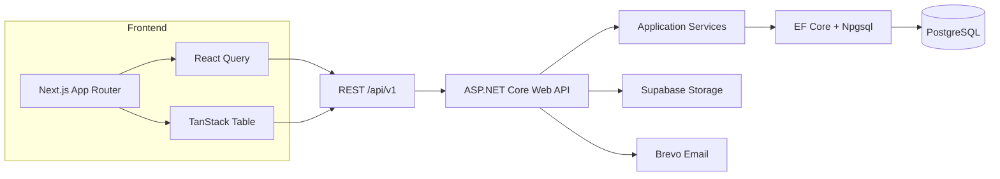
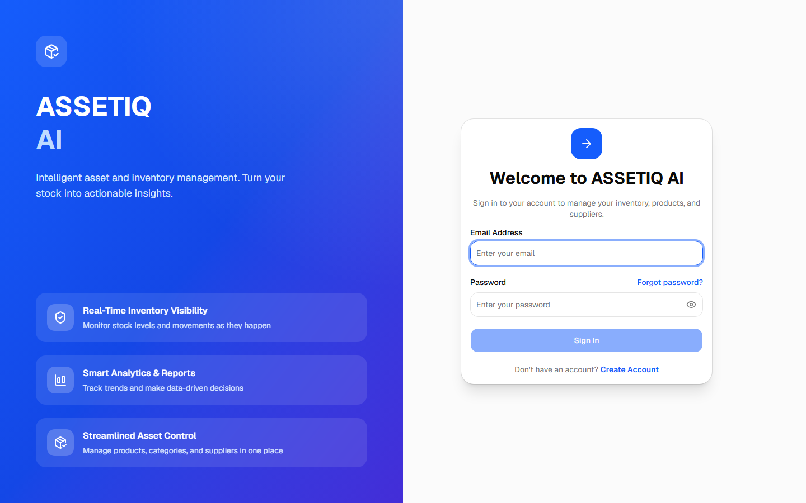
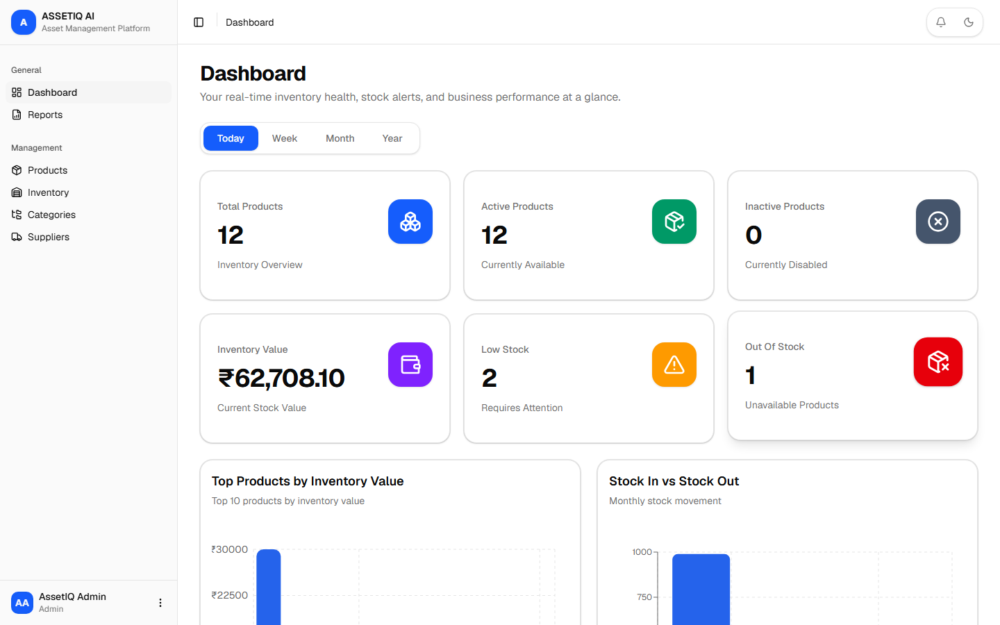
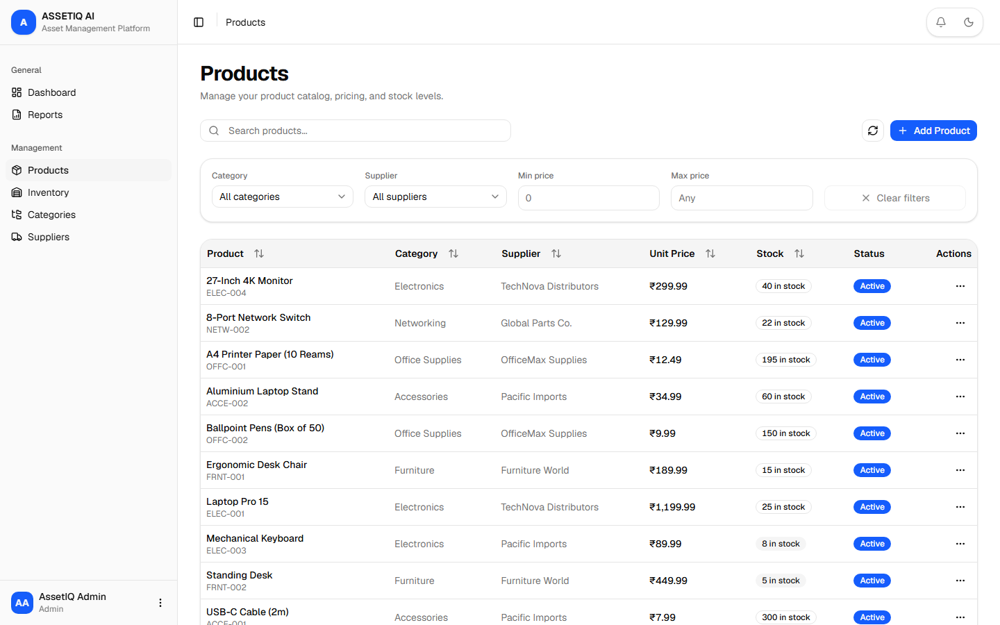
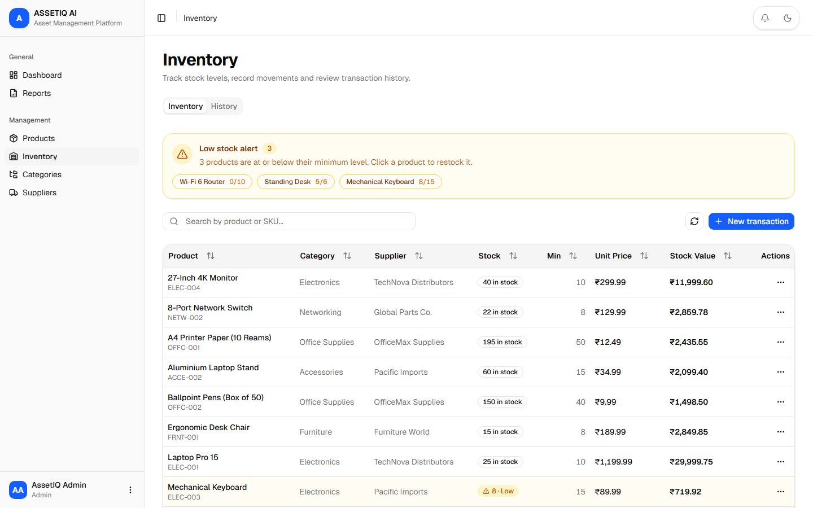
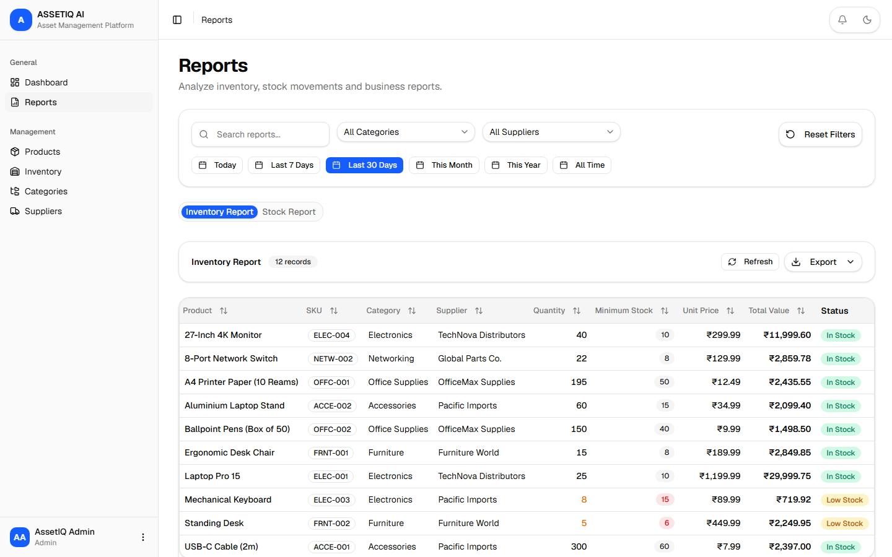

<div align="center">

# ASSETIQ AI

**Intelligent asset and inventory management platform**

Full-stack inventory management with real-time dashboards, stock tracking, reporting, and AI-ready analytics.

[Live Demo](https://assetiq-ai-beta.vercel.app) · [Backend API](https://assetiq-ai.onrender.com)

</div>

---

## Table of Contents

- [Demo Credentials](#demo-credentials)
- [Features](#features)
- [Tech Stack](#tech-stack)
- [Architecture](#architecture)
- [Project Structure](#project-structure)
- [Getting Started](#getting-started)
- [Environment Variables](#environment-variables)
- [Deployment](#deployment)
- [Screenshots](#screenshots)
- [Roadmap](#roadmap)

## Demo Credentials

Use the seeded demo account to explore the application — no registration required:

| Role | Email | Password |
| --- | --- | --- |
| Admin | `admin@assetiq.ai` | `Demo@12345` |

The demo account comes pre-loaded with sample categories, suppliers, products, and stock history so every screen is populated.

## Features

- **Dashboard** — real-time summary cards, stock trends, category/supplier breakdowns, low-stock and out-of-stock alerts, recent transactions.
- **Products** — full CRUD with search, category/supplier filtering, price range filters, and pagination.
- **Inventory** — stock-in / stock-out / adjustment dialogs, live quantity updates, and a searchable transaction history with date and type filters.
- **Categories & Suppliers** — full CRUD with delete-protection when records are in use.
- **Reports** — inventory and stock movement reports with filters and CSV/Excel export.
- **Authentication** — JWT access + refresh tokens, role-based access (Admin / Manager / Employee), password reset via email, session idle/expiry handling.
- **Profile** — view account details, copyable fields, and logout.
- **Polish** — responsive layout, light/dark theme, loading skeletons, empty states, error states, and toast notifications.

## Tech Stack

### Frontend
- **Next.js 16** (App Router, Server & Client Components) + React 19 + TypeScript
- **Tailwind CSS v4** with shadcn/ui component library
- **TanStack Query** (server state), **TanStack Table** (data tables), **React Hook Form + Zod** (forms/validation)
- **Recharts** (charts), **Sonner** (toasts), **next-themes** (dark mode)

### Backend
- **ASP.NET Core 10** Web API (.NET 10), Clean Architecture
- **Entity Framework Core 10** + Npgsql, EF Core Migrations
- **PostgreSQL** database
- **ASP.NET Identity PasswordHasher** (PBKDF2) for credential hashing
- **Supabase Storage** for file uploads
- **Brevo HTTP API** for transactional email (password reset)

### Infrastructure
- Frontend: Vercel
- Backend + Database: Render (Docker, free tier, health checks at `/health`)
- Source control: GitHub

## Architecture



The backend follows **Clean Architecture** with three layers:

- **AssetIQAI.Domain** — entities, enums, and core interfaces.
- **AssetIQAI.Infrastructure** — EF Core `ApplicationDbContext`, repositories, services, and a runtime `DbSeeder` that applies migrations and seeds roles + demo data on startup.
- **AssetIQAI.API** — controllers, validation (FluentValidation), JWT auth, API versioning (`/api/v1`), global exception handling, and health checks.

All business data is **ownership-scoped** (`OwnerId`) so each user only ever sees their own records.

## Project Structure

```text
assetiq-ai/
├── assetiqai-frontend/        # Next.js 16 frontend
│   └── src/
│       ├── app/               # App Router pages (auth, dashboard, products, ...)
│       ├── components/        # Shared + layout + UI components
│       ├── features/          # Feature modules (auth, products, inventory, ...)
│       ├── providers/         # React Query, theme, auth providers
│       └── shared/            # Export utilities (CSV/Excel)
├── backend/                   # ASP.NET Core 10 solution
│   ├── AssetIQAI.API/         # Web API, controllers, validation, JWT
│   ├── AssetIQAI.Domain/      # Entities, enums, core contracts
│   ├── AssetIQAI.Infrastructure/  # DbContext, repositories, seeder
│   └── tests/
└── render.yaml                # Render backend blueprint
```

## Getting Started

### Prerequisites
- Node.js 20+
- .NET 10 SDK
- PostgreSQL 15+ (local) or a remote instance

### 1. Backend

```bash
cd backend

# 1. Set the connection string (local dev)
#    appsettings.Development.json -> "ConnectionStrings:DefaultConnection"

# 2. Run the API (applies migrations + seeds roles & demo data on startup)
dotnet run --project AssetIQAI.API
```

The API listens on `http://localhost:7173` (see `launchSettings.json`). Swagger is available at `/swagger` (local development only).

### 2. Frontend

```bash
cd assetiqai-frontend
npm install
cp .env.example .env.local   # then fill in values (see below)
npm run dev
```

Open [http://localhost:3000](http://localhost:3000).

## Environment Variables

### Frontend (`assetiqai-frontend/.env.local`)

| Variable | Description |
| --- | --- |
| `NEXT_PUBLIC_API_URL` | Backend API base URL, e.g. `https://assetiq-ai.onrender.com/api` |

### Backend (Render dashboard or `appsettings`)

| Variable | Description |
| --- | --- |
| `ConnectionStrings__DefaultConnection` | PostgreSQL connection string |
| `Jwt__Secret` | JWT signing secret (never commit) |
| `Jwt__Issuer` | JWT issuer |
| `Jwt__Audience` | JWT audience |
| `CORS_ORIGINS` | Comma-separated allowed frontend origins |
| `App__FrontendBaseUrl` | Frontend base URL used in emails |
| `Supabase__Url` / `Supabase__ServiceRoleKey` / `Supabase__Bucket` | Storage for uploads |
| `Email__Enabled` / Brevo keys | Transactional email via Brevo HTTP API |

## Deployment

The project is deployed via **Render** (backend + PostgreSQL) and **Vercel** (frontend).

- Backend: connect this repo to Render, use the `render.yaml` blueprint (Docker, free tier, `/health` health check).
- Frontend: import `assetiqai-frontend` into Vercel with `NEXT_PUBLIC_API_URL` pointing at the Render API.

## Screenshots

### Login



### Dashboard



### Products



### Inventory



### Reports



## Roadmap

- AI-powered demand forecasting and low-stock recommendations.
- Barcode/QR scanning for stock operations.
- Multi-warehouse support.
- CSV/Excel import of products and suppliers.

---

Built with Next.js, ASP.NET Core, and PostgreSQL.
